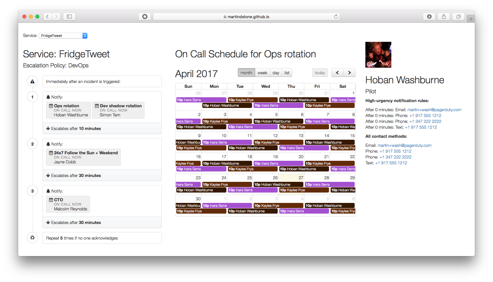

# PDoncall
PagerDuty On-Call Dashboard



This is a dashboard that lets you see who's on call for any of your services. Select a service from the drop-down, and the Escalation Policy will be shown on the left, along with who's currently on call for each schedule in the escalation. Click on a schedule or a user to show more information about them.

## Instructions for use:

Construct a URL like so:

```
https://pagerduty.github.io/addons/PDoncall/index.html?token=<TOKEN>
```

Replace <TOKEN> with a read-only v2 API token. That's it! You should now see the service menu populate and information about the first service's escalation policy.
